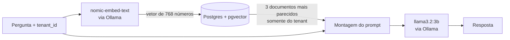
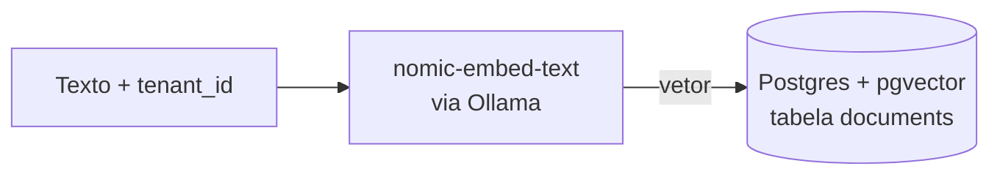

# Plataforma RAG Multi-Tenant (laboratório)

Projeto de estudo prático de **AI Platform Engineering**: uma plataforma de RAG (Retrieval-Augmented Generation) que atende vários clientes (tenants) com isolamento de dados, rodando 100% local.

O objetivo não é só fazer uma IA responder perguntas. É construir, passo a passo, a infraestrutura que um time de plataforma precisaria operar em produção: isolamento entre clientes, observabilidade, segurança, custo e deploy.

> **Status:** Fase 1 (Núcleo) quase concluída. Veja o [ROADMAP](ROADMAP.md) para as próximas fases e o [Diário](docs/DIARIO.md) para o registro de cada etapa.

---

## Novo por aqui? Comece pelos conceitos

Se termos como *embedding*, *vetor* ou *RAG* ainda são novos, leia primeiro o guia [Conceitos para iniciantes](docs/CONCEITOS.md). São 5 minutos e o resto do projeto passa a fazer sentido.

Resumo em uma frase: **um modelo de embedding transforma texto em números, o banco encontra os documentos com números parecidos com os da pergunta, e o LLM escreve a resposta usando só esses documentos.**

---

## Arquitetura atual

**Consulta (pergunta de um cliente):**



**Ingestão (adicionar um documento):**



### Componentes

| Componente | Papel | Onde roda |
|---|---|---|
| **Ollama** | Serve os dois modelos via API HTTP na porta 11434 | Nativo na máquina (usa a GPU diretamente) |
| **llama3.2:3b** | LLM: gera a resposta em texto | Ollama |
| **nomic-embed-text** | Modelo de embedding: transforma texto em vetor de 768 dimensões | Ollama |
| **PostgreSQL 16 + pgvector** | Guarda os documentos e seus vetores, faz a busca por similaridade | Container Docker |
| **ingest.py** | Liga tudo: gera embeddings, insere, busca e chama o LLM | Python local (venv) |

---

## Pré-requisitos

- [Docker Desktop](https://www.docker.com/products/docker-desktop/)
- [Ollama](https://ollama.com)
- Python 3.11 ou superior
- GPU recomendada (o projeto foi desenvolvido com 12 GB de VRAM; os dois modelos juntos usam cerca de 2,5 GB)

---

## Como rodar do zero

### 1. Configurar as variáveis de ambiente

Nenhuma senha fica no código. Copie o arquivo de exemplo e preencha com seus valores:

```bash
cp .env.example .env
```

O arquivo `.env` está no `.gitignore` e **nunca** deve ir para o repositório.

### 2. Baixar os modelos no Ollama

```bash
ollama pull llama3.2:3b
ollama pull nomic-embed-text
```

### 3. Subir o banco

```bash
docker compose up -d
```

### 4. Criar a estrutura do banco

```bash
docker exec -i rag-postgres psql -U <seu_usuario> -d <seu_banco> < sql/001_schema.sql
```

Esse script habilita a extensão `vector`, cria a tabela `documents` e os índices.

### 5. Preparar o Python

```bash
python -m venv .venv
source .venv/Scripts/activate   # Windows (Git Bash). No Linux/macOS: source .venv/bin/activate
pip install -r requirements.txt
```

### 6. Executar

```bash
python ingest.py
```

---

## Como usar (funções do `ingest.py`)

| Função | O que faz |
|---|---|
| `generate_embedding(text)` | Chama o Ollama e devolve o vetor de 768 números de um texto |
| `insert_document(tenant_id, content, embedding)` | Grava um documento e seu vetor no banco |
| `search_similar(tenant_id, query_text, limit=3)` | Busca os documentos mais parecidos com a pergunta, **somente dentro do tenant informado** |
| `build_prompt(question, documents)` | Monta o prompt instruindo o LLM a responder apenas com base no contexto |
| `generate_answer(prompt)` | Chama o LLM e devolve a resposta em texto |
| `rag_query(tenant_id, question)` | Fluxo completo: busca, monta o prompt e gera a resposta |

Exemplo:

```python
resposta = rag_query("tenant_a", "Como o Kubernetes agenda pods de treino distribuído?")
print(resposta)
```

---

## Estrutura do repositório

```
.
├── README.md              # este arquivo
├── ROADMAP.md             # fases do projeto
├── docker-compose.yaml    # Postgres + pgvector
├── .env.example           # modelo das variáveis de ambiente (sem valores reais)
├── .gitignore             # arquivos que nunca vão para o repositório (.env, .venv)
├── requirements.txt       # dependências Python
├── ingest.py              # código da plataforma
├── sql/
│   └── 001_schema.sql     # criação da tabela e índices
└── docs/
    ├── CONCEITOS.md       # guia para iniciantes
    └── DIARIO.md          # registro de cada etapa, com resultados e erros
```

---

## Decisões de arquitetura

Cada escolha tem um motivo, e o motivo importa mais que a ferramenta.

| Decisão | Por quê |
|---|---|
| **pgvector em vez de um banco vetorial dedicado** | Postgres é conhecido e maduro; o pgvector adiciona busca vetorial sem introduzir uma tecnologia nova. Um banco dedicado só se justifica em escala bem maior |
| **Ollama nativo, fora do container** | Acesso direto à GPU sem configurar GPU passthrough no Docker/WSL2 nesta fase |
| **Docker Compose antes de Kubernetes** | Primeiro provar que a lógica funciona, depois platformizar. Não se desenha orquestração para algo que ainda não se sabe se funciona |
| **`tenant_id NOT NULL` + índice** | Todo documento tem dono, sem exceção. O índice evita varredura completa da tabela a cada filtro por tenant |
| **Índice HNSW com distância de cosseno** | Busca aproximada muito mais rápida que comparar a pergunta com todos os vetores, com perda mínima de precisão |
| **Queries parametrizadas (`%s`)** | Defesa contra SQL injection: o valor enviado é sempre tratado como dado, nunca como comando |
| **Prompt restrito ao contexto** | O LLM é instruído a responder apenas com os documentos recuperados e a admitir quando não sabe, reduzindo alucinação |

---

## Laboratório vs produção

Este projeto imita um ambiente de produção, mas algumas lacunas são conhecidas e estão planejadas no [ROADMAP](ROADMAP.md):

- O isolamento entre tenants depende do código lembrar de filtrar (`WHERE tenant_id`). Em produção, isso deve ser garantido pelo próprio banco (Row Level Security, Fase 6)
- A aplicação conecta ao banco com um usuário administrador. Em produção, deve usar um usuário com o mínimo de privilégios necessários (Fase 6)
- Não há autenticação: quem chama a função escolhe o `tenant_id`. Isso será resolvido quando a plataforma virar uma API (Fase 2)
- Não há métricas nem logs estruturados (Fase 4)
- As credenciais vêm de um arquivo `.env` local. Em produção, viriam de um gerenciador de segredos (Fase 6)
